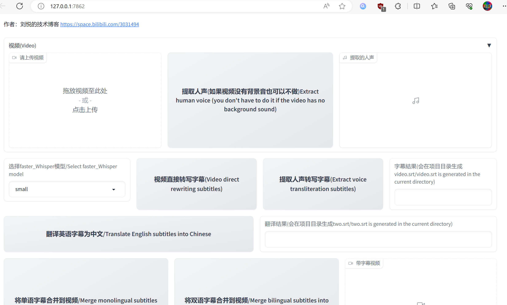

<div align="center">

<h1>Modelscope_Faster_Whisper_Multi_Subtitle</h1>

<h2>基于Faster-whisper和modelscope一键生成双语字幕，双语字幕生成器,基于离线大模型</h2>

<h2>Generate bilingual subtitles with one click based on Faster-whisper and modelscope. Off-line large model</h2>

<br><br>


</div>

------


### Quick Install with Conda

```bash
conda create -n venv python=3.9
conda activate venv
bash install.sh
```
### Install Manually
#### Make sure you have the distutils for python3 installed

```bash
sudo apt-get install python3.9-distutils
```

#### Pip Packages

```bash
pip install -r requirements.txt
```

```bash

pip install torch torchvision torchaudio --index-url https://download.pytorch.org/whl/cu118 
```


#### FFmpeg

##### Conda Users
```bash
conda install ffmpeg
```

##### Ubuntu/Debian Users

```bash
sudo apt install ffmpeg
sudo apt install libsox-dev
conda install -c conda-forge 'ffmpeg<7'
```

##### MacOS Users

```bash
brew install ffmpeg
```

##### Windows Users

```bash
winget install ffmpeg
```

or

```
choco install ffmpeg
```

## how to use

```
python3 app.py
```



## Credits

Special thanks to the following projects and contributors:

- [faster-whisper](https://github.com/SYSTRAN/faster-whisper)
- [Csanmt](https://modelscope.cn/models/iic/)


